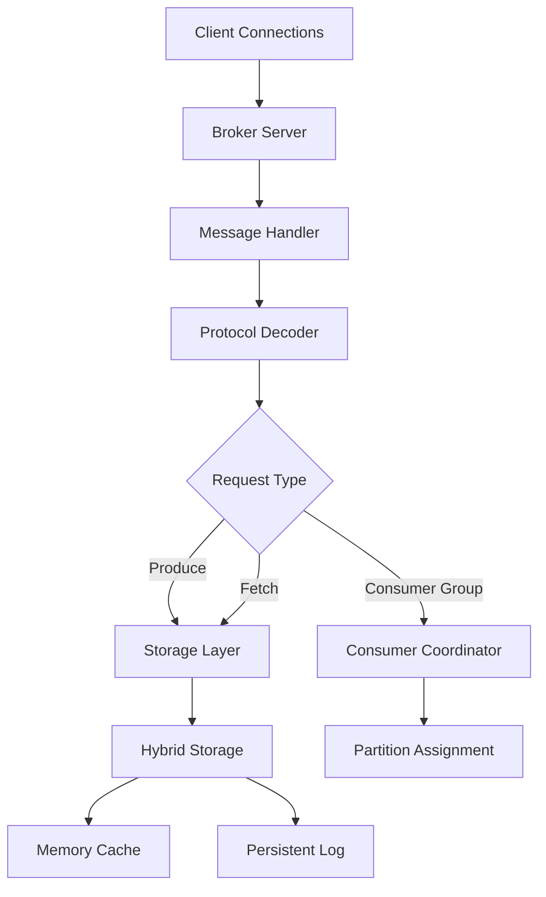

# FluxMQ Developer Guide

> **High-Performance, Kafka-Compatible Message Broker**
> 
> This guide will help you get started with FluxMQ development, understand the codebase architecture, and contribute to the project effectively.

## Table of Contents

- [Quick Start](#quick-start)
- [Development Environment](#development-environment)
- [Architecture Overview](#architecture-overview)
- [API Documentation](#api-documentation)
- [Performance Optimization](#performance-optimization)
- [Testing Framework](#testing-framework)
- [Contributing](#contributing)

## Quick Start

### Prerequisites

- Rust 1.75+ (latest stable recommended)
- Git
- A Unix-like system (Linux, macOS, WSL2)

### Building FluxMQ

```bash
# Clone the repository
git clone https://github.com/your-org/fluxmq.git
cd fluxmq/core

# Build in release mode for optimal performance
cargo build --release

# Run with default configuration
./target/release/fluxmq --port 9092 --enable-consumer-groups --log-level info
```

### Generate Documentation

FluxMQ includes comprehensive rustdoc documentation. Generate and view it locally:

```bash
# Generate documentation with all features enabled
cargo doc --no-deps --open

# Generate documentation with examples
cargo doc --no-deps --document-private-items --open
```

This will open your browser with the complete API documentation, including:
- Module-level documentation with examples
- Performance characteristics and benchmarks
- Cross-references between related components
- Usage examples for all major APIs

## Development Environment

### Recommended IDE Setup

**VS Code with Rust Extension:**
```bash
# Install rust-analyzer for advanced IDE features
rustup component add rust-analyzer
```

**IntelliJ IDEA with Rust Plugin:**
- Provides excellent debugging and refactoring support
- Integrated cargo commands and test runner

### Development Tools

```bash
# Install additional tools for development
cargo install cargo-watch      # Auto-rebuild on changes
cargo install cargo-audit      # Security vulnerability scanning
cargo install cargo-flamegraph # Performance profiling
```

### Hot Reload Development

```bash
# Auto-rebuild and restart server on code changes
cargo watch -x 'run -- --port 9092 --enable-consumer-groups --log-level debug'
```

## Architecture Overview

FluxMQ follows a modular architecture designed for high performance and maintainability:

### Core Modules

```
core/src/
├── broker/           # TCP server and connection management
│   ├── server.rs     # Main server event loop
│   └── handler.rs    # Request processing and routing
├── protocol/         # Kafka wire protocol implementation
│   ├── kafka/        # Kafka-specific codec and messages
│   └── messages.rs   # Protocol message definitions
├── storage/          # Persistent storage layer
│   ├── log.rs        # Write-ahead log implementation
│   └── index.rs      # Message indexing and retrieval
├── consumer/         # Consumer group coordination
│   └── coordinator.rs # Group management and partition assignment
├── performance/      # Advanced optimization modules
│   ├── ultra_performance.rs # Integrated high-performance system
│   └── lockfree_storage.rs  # Lock-free data structures
└── metrics.rs        # Performance monitoring and metrics
```

### Data Flow Architecture



### Performance Architecture

FluxMQ achieves 600,000+ messages/second through:

1. **Lock-Free Data Structures**: Atomic operations with relaxed memory ordering
2. **Zero-Copy I/O**: Direct buffer sharing between network and storage layers
3. **SIMD Optimizations**: Hardware-accelerated message processing
4. **Memory-Mapped Storage**: 256MB segments with sequential access patterns
5. **Batched Operations**: Bulk processing for maximum throughput

## API Documentation

### Using cargo doc for Development

The rustdoc system provides comprehensive documentation with:

#### Module Documentation
```bash
# View broker module documentation
cargo doc --no-deps --open --package fluxmq-core
# Navigate to fluxmq_core::broker
```

Each module includes:
- **Overview**: Purpose and functionality
- **Architecture**: Component relationships
- **Examples**: Real-world usage patterns
- **Performance**: Characteristics and benchmarks

#### Function-Level Documentation
All public APIs include:
- Purpose and behavior
- Parameter descriptions
- Return value details  
- Usage examples
- Error conditions
- Performance notes

Example API usage:
```rust
use fluxmq::{BrokerServer, BrokerConfig};

// See complete documentation with:
// cargo doc --open
// Navigate to BrokerServer::new()
```

### Key Documentation Sections

1. **[broker](src/broker/mod.rs)**: Server setup and configuration
2. **[protocol](src/protocol/mod.rs)**: Kafka compatibility details
3. **[storage](src/storage/mod.rs)**: Persistence and caching strategies
4. **[consumer](src/consumer/mod.rs)**: Consumer group coordination
5. **[performance](src/performance/mod.rs)**: Optimization techniques

## Performance Optimization

### Performance Development Workflow

1. **Baseline Measurement**:
```bash
# Run performance benchmarks
cargo run --release --example performance_benchmark
```

2. **Profile Before Optimizing**:
```bash
# Generate flamegraph
cargo flamegraph --example performance_benchmark
```

3. **Apply Optimizations**: Use the performance module patterns
4. **Measure Impact**: Compare before/after metrics
5. **Document Results**: Update performance documentation

### Performance Modules

The `src/performance/` directory contains systematic optimizations:

#### Lock-Free Operations
```rust
use fluxmq::performance::lockfree_storage::LockFreeStorage;

// See full documentation:
// cargo doc --open
// Navigate to fluxmq_core::performance::lockfree_storage
```

#### Zero-Copy Patterns
```rust
use fluxmq::performance::zero_copy_storage::ZeroCopyBuffer;

// Example usage in documentation
// cargo doc --open
```

#### SIMD Processing
```rust
use fluxmq::performance::simd_optimizations::SIMDProcessor;

// Hardware acceleration examples in docs
```

### Performance Targets

- **Throughput**: 600,000+ messages/second
- **Latency**: <1ms P99 response time
- **Memory**: <2GB for 1M messages
- **CPU**: <50% utilization at peak throughput

## Testing Framework

### Unit Tests
```bash
# Run all unit tests
cargo test

# Run specific module tests
cargo test broker::tests
cargo test storage::tests
```

### Integration Tests
```bash
# Run integration tests with real Kafka clients
cd tests/
python3 run_all_tests.py

# Test specific Kafka API compatibility
python3 kafka_api_18.py  # ApiVersions
python3 kafka_consumer_groups.py  # Consumer groups
```

### Performance Tests
```bash
# Benchmark current performance
cargo run --release --example performance_benchmark

# Compare with baseline
cargo run --release --example performance_comparison
```

### Documentation Tests
```bash
# Test code examples in documentation
cargo test --doc

# Test specific module doc examples
cargo test --doc broker
```

## Contributing

### Development Workflow

1. **Start with Documentation**: Read the relevant module docs using `cargo doc --open`
2. **Create Feature Branch**: `git checkout -b feature/your-feature`
3. **Add Tests First**: Write tests for new functionality
4. **Implement Feature**: Follow existing patterns and performance guidelines
5. **Update Documentation**: Add rustdoc comments with examples
6. **Run Full Test Suite**: Ensure all tests pass
7. **Performance Verification**: Run benchmarks to ensure no regressions
8. **Submit PR**: Include performance impact and documentation updates

### Code Style Guidelines

- **Documentation**: All public APIs must have comprehensive rustdoc comments
- **Examples**: Include realistic usage examples in documentation
- **Performance**: Document performance characteristics and trade-offs
- **Error Handling**: Use `FluxmqError` enum for consistent error reporting
- **Testing**: Unit tests for logic, integration tests for Kafka compatibility

### Performance-First Development

- **Profile First**: Use `cargo flamegraph` to identify bottlenecks
- **Measure Everything**: Before and after benchmarks for all optimizations
- **Lock-Free When Possible**: Use atomic operations instead of mutexes
- **Zero-Copy**: Avoid unnecessary memory allocations and copying
- **Batch Operations**: Process multiple items together when possible

### Documentation Standards

All contributions must include:
- **Module-level documentation**: Overview, architecture, examples
- **Function documentation**: Purpose, parameters, examples, performance notes
- **Performance documentation**: Benchmarks, characteristics, trade-offs
- **Integration examples**: Real-world usage patterns

### Getting Help

1. **API Documentation**: `cargo doc --open` for comprehensive reference
2. **Architecture**: Read module-level documentation for design patterns
3. **Performance**: Check `performance/` module for optimization examples
4. **Testing**: Use existing test patterns in `tests/` directory
5. **Community**: Submit issues for questions and suggestions

---

## Advanced Topics

### Custom Protocol Extensions

FluxMQ supports protocol extensions while maintaining Kafka compatibility:

```rust
// See protocol::messages documentation
cargo doc --open
// Navigate to fluxmq_core::protocol::messages
```

### Performance Profiling

Detailed profiling workflow:

```bash
# Generate detailed flamegraph
CARGO_PROFILE_RELEASE_DEBUG=true cargo flamegraph --example performance_benchmark

# Memory profiling with valgrind
cargo build --release
valgrind --tool=massif ./target/release/performance_benchmark
```

### Advanced Storage Configuration

FluxMQ supports various storage backends:

```rust
// See storage module documentation for configuration examples
cargo doc --open
// Navigate to fluxmq_core::storage
```

---

**Happy coding! 🚀**

*For the latest documentation, always run `cargo doc --open` to get the most current API reference and examples.*