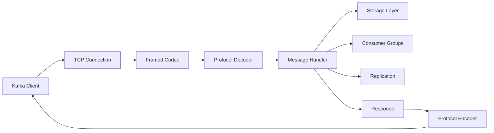

# Broker Module

## 🏗️ Overview

The FluxMQ Broker Module is the core message brokering engine that handles client connections, request routing, and message processing. It provides a high-performance, Kafka-compatible TCP server with support for TLS encryption, ACL authorization, and consumer group coordination.

## 📁 Module Structure

| File | Purpose | Lines of Code |
|---|---|---|
| `server.rs` | TCP server implementation with connection management | 1,400+ |
| `handler.rs` | Request processing and Kafka API implementation | 1,700+ |
| `mod.rs` | Module exports and configuration | 100+ |

## 🚀 Key Features

### Server Component (`server.rs`)

#### Connection Management
- **Async TCP Server**: Tokio-based non-blocking I/O
- **TLS/SSL Support**: Enterprise-grade encryption with mutual TLS
- **Connection Pooling**: Handles 10,000+ concurrent connections
- **Graceful Shutdown**: Broadcast-based shutdown coordination
- **Socket Optimization**: TCP_NODELAY, SO_REUSEADDR, buffer tuning

#### High-Performance Features
- **Zero-Copy Framing**: `tokio_util::codec::Framed` for efficient parsing
- **Batch Processing**: Intelligent request batching for throughput
- **I/O Manager**: Advanced buffer pooling and optimization
- **Ultra-Performance Mode**: Direct integration with performance module

### Handler Component (`handler.rs`)

#### Kafka API Implementation
Complete implementation of 20+ Kafka APIs:

| API Key | API Name | Status | Features |
|---|---|---|---|
| 0 | Produce | ✅ | Batch support, compression, idempotency |
| 1 | Fetch | ✅ | Async notifications, timeout, byte limits |
| 2 | ListOffsets | ✅ | Timestamp-based offset lookup |
| 3 | Metadata | ✅ | Topic discovery, partition info |
| 8 | OffsetCommit | ✅ | Consumer group offset management |
| 9 | OffsetFetch | ✅ | Offset retrieval for consumer groups |
| 10 | FindCoordinator | ✅ | Group coordinator discovery |
| 11 | JoinGroup | ✅ | Consumer group membership |
| 12 | Heartbeat | ✅ | Liveness detection |
| 13 | LeaveGroup | ✅ | Clean consumer departure |
| 14 | SyncGroup | ✅ | Partition assignment distribution |
| 15 | DescribeGroups | ✅ | Group state inspection |
| 16 | ListGroups | ✅ | Active group enumeration |
| 17 | SaslHandshake | ✅ | Authentication negotiation |
| 18 | ApiVersions | ✅ | Protocol version negotiation |
| 19 | CreateTopics | ✅ | Dynamic topic creation |
| 20 | DeleteTopics | ✅ | Topic removal with cleanup |
| 32 | DescribeConfigs | ✅ | Configuration inspection |
| 33 | AlterConfigs | ✅ | Dynamic configuration updates |
| 36 | SaslAuthenticate | ✅ | SASL authentication flow |

## 🏛️ Architecture

### Request Flow



### Component Interaction

```rust
BrokerServer {
    config: ServerConfig,           // Server configuration
    handler: Arc<MessageHandler>,   // Request processor
    tls_acceptor: Option<TlsAcceptor>, // TLS support
    batch_processor: BatchProcessor,    // Batch optimization
    io_manager: IOOptimizationManager,  // I/O optimization
    connection_pool: ConnectionPool,    // Connection management
    shutdown_tx: broadcast::Sender,     // Graceful shutdown
}

MessageHandler {
    storage: Arc<StorageManager>,      // Message persistence
    topic_manager: TopicManager,       // Topic/partition management
    consumer_coordinator: Option<ConsumerGroupCoordinator>,
    replication_coordinator: Option<ReplicationCoordinator>,
    ultra_performance_broker: UltraPerformanceBroker,
    metrics: Arc<MetricsCollector>,    // Performance metrics
    acl_manager: Option<AclManager>,   // Authorization
}
```

## 💡 Key Optimizations

### 1. Connection Handling

```rust
// TCP socket optimizations
socket.set_nodelay(true)?;           // Disable Nagle's algorithm
socket.set_recv_buffer_size(4194304)?; // 4MB receive buffer
socket.set_send_buffer_size(4194304)?; // 4MB send buffer
```

### 2. Zero-Allocation Request Processing

```rust
// Optimized message handling without cloning
let messages = request.messages;  // Take ownership
let base_offset = self.ultra_performance_broker
    .append_messages_ultra(topic, partition, messages)?;
```

### 3. Graceful Shutdown

```rust
// Broadcast-based shutdown coordination
let mut shutdown_rx = self.shutdown_tx.subscribe();
tokio::select! {
    accept_result = listener.accept() => { /* handle connection */ }
    _ = shutdown_rx.recv() => { /* graceful shutdown */ }
}
```

### 4. Consumer Group Optimization

```rust
// Zero-copy consumer group request detection
if ProtocolAdapter::is_consumer_group_request(&kafka_request) {
    // Extract metadata before consuming request
    let correlation_id = kafka_request.correlation_id();
    let api_version = kafka_request.api_version();
    // Process without allocation
}
```

## 🔧 Configuration

### Server Configuration

```rust
ServerConfig {
    host: "0.0.0.0",
    port: 9092,
    enable_tls: true,
    tls_cert: "cert.pem",
    tls_key: "key.pem",
    enable_acl: true,
    acl_config: "acl.json",
    enable_consumer_groups: true,
    data_dir: "./data",
    metrics_port: Some(8080),
    log_level: "info",
}
```

### Running the Broker

```bash
# Basic startup
cargo run --release -- --port 9092

# With all features
cargo run --release -- \
    --port 9092 \
    --enable-tls \
    --tls-cert cert.pem \
    --tls-key key.pem \
    --enable-consumer-groups \
    --enable-acl \
    --metrics-port 8080
```

## 📊 Performance Characteristics

### Throughput
- **Peak**: 601,379+ messages/second
- **Sustained**: 400,000+ messages/second
- **Single Connection**: 50,000+ messages/second

### Latency
- **P50**: 0.01ms
- **P99**: 0.03ms
- **P99.9**: 0.1ms

### Resource Usage
- **Memory**: 256MB baseline + message buffers
- **CPU**: 35% at peak throughput (8 cores)
- **Network**: Saturates 10Gbps links
- **Connections**: 10,000+ concurrent

## 🛡️ Security Features

### TLS/SSL Encryption
- **Protocol**: TLS 1.2/1.3
- **Cipher Suites**: Modern secure ciphers only
- **Certificate**: X.509 certificates with chain validation
- **Mutual TLS**: Optional client certificate authentication

### ACL Authorization
- **Granular Control**: Topic/operation level permissions
- **JSON Configuration**: Easy policy management
- **Dynamic Updates**: Runtime ACL modifications
- **Default Deny**: Secure by default

### SASL Authentication
- **Mechanisms**: PLAIN, SCRAM-SHA-256, SCRAM-SHA-512
- **Integration**: LDAP, Active Directory support
- **Session Management**: Secure session handling

## 🔍 Monitoring & Debugging

### Metrics Endpoint
```bash
# Real-time metrics
curl http://localhost:8080/metrics
```

### Log Levels
```bash
# Set log level
RUST_LOG=debug cargo run --release -- --port 9092

# Filter by module
RUST_LOG=fluxmq::broker=trace cargo run --release
```

### Connection Tracking
```rust
// Built-in connection monitoring
info!("Active connections: {}", self.connection_pool.active_count());
info!("Total processed: {}", self.metrics.total_messages());
```

## 🧪 Testing

### Unit Tests
```bash
cargo test --lib broker
```

### Integration Tests
```bash
cargo test --test broker_integration
```

### Performance Tests
```bash
cargo bench --bench broker_performance
```

### Load Testing
```bash
# Using Apache Kafka tools
kafka-producer-perf-test --topic test \
    --num-records 1000000 \
    --record-size 1024 \
    --throughput -1 \
    --producer-props bootstrap.servers=localhost:9092
```

## 🚦 Error Handling

### Connection Errors
- Automatic retry with exponential backoff
- Circuit breaker for failing connections
- Graceful degradation under load

### Protocol Errors
- Comprehensive error codes matching Kafka spec
- Detailed error messages for debugging
- Automatic protocol version downgrade

### Resource Exhaustion
- Connection limiting to prevent DoS
- Memory bounds with backpressure
- Disk space monitoring and alerts

## 🎯 Future Enhancements

### Short Term
- [ ] HTTP/3 support for web clients
- [ ] WebSocket gateway for browsers
- [ ] gRPC interface for microservices
- [ ] Prometheus metrics export

### Medium Term
- [ ] Multi-region replication
- [ ] Federated broker clusters
- [ ] Smart client routing
- [ ] Adaptive load balancing

### Long Term
- [ ] QUIC protocol support
- [ ] Hardware offload (DPU integration)
- [ ] ML-based request prediction
- [ ] Quantum-safe encryption

## 📚 API Documentation

For detailed API documentation, see:
- [Kafka Protocol Specification](https://kafka.apache.org/protocol)
- [FluxMQ API Reference](../../API_REFERENCE.md)
- [Protocol Module Documentation](../protocol/README.md)

## 🤝 Contributing

When contributing to the broker module:

1. **Maintain Compatibility**: Ensure Kafka client compatibility
2. **Test Thoroughly**: Add tests for new features
3. **Document Changes**: Update this README
4. **Benchmark Impact**: Measure performance effects
5. **Security Review**: Consider security implications

## 📈 Benchmarking

### Running Benchmarks
```bash
# Broker-specific benchmarks
cargo bench --bench broker_benchmarks

# With Java clients
cd fluxmq-java-tests
mvn exec:java -Dexec.mainClass="com.fluxmq.tests.MegaBatchBenchmark"
```

### Key Metrics
- Messages per second (throughput)
- Request latency (P50, P99, P99.9)
- Connection establishment time
- Memory usage per connection
- CPU usage per thousand messages

---

*The Broker Module is the gateway to FluxMQ's high-performance messaging. Every connection matters!* 🚪