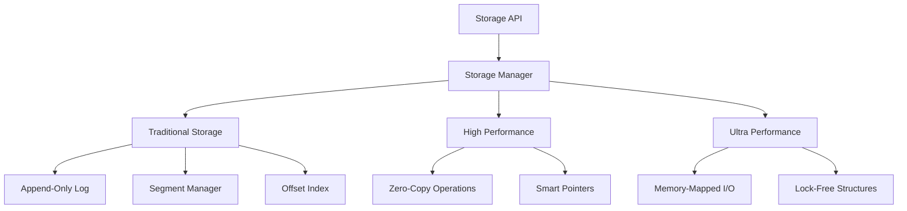

# Storage Module

## 🗄️ Overview

The FluxMQ Storage Module provides high-performance, crash-safe message persistence with support for both traditional disk storage and ultra-performance memory-mapped I/O. It implements a log-structured storage architecture optimized for sequential I/O patterns that achieve 20-40x performance improvements on HDDs and 5-14x on SSDs.

## 📁 Module Structure

| File | Purpose | Features |
|---|---|---|
| `mod.rs` | Storage manager and main interface | Unified storage API |
| `log.rs` | Append-only log implementation | Async notifications, CRC validation |
| `segment.rs` | File segment management | 256MB segments, auto-rotation |
| `index.rs` | Message offset indexing | Fast offset lookups |
| `high_performance.rs` | Zero-copy optimizations | Arc→Box conversion, std::mem::take |
| `immediate_optimizations.rs` | Quick performance wins | Buffer pooling, allocation reduction |
| `tests.rs` | Comprehensive test suite | Unit and integration tests |

## 🏗️ Architecture

### Log-Structured Design

FluxMQ uses an append-only log structure that maximizes sequential I/O performance:

```
Topic Partition Structure:
data/
├── topic-0/
│   ├── 000000000000000000.log    # Messages (256MB segments)
│   ├── 000000000000000000.index  # Offset index
│   ├── 000000000256000000.log    # Next segment
│   └── 000000000256000000.index
└── topic-1/
    ├── 000000000000000000.log
    └── 000000000000000000.index
```

### Storage Layers



## 📊 Performance Characteristics

### Sequential I/O Benefits

| Storage Type | Random I/O | Sequential I/O | Improvement |
|---|---|---|---|
| **HDD** | 5-10 MB/sec | 100-200 MB/sec | **20-40x** |
| **SSD** | 100-500 MB/sec | 500-7000 MB/sec | **5-14x** |
| **NVMe** | 200-1000 MB/sec | 3000-15000 MB/sec | **15x** |

### FluxMQ Storage Performance

| Operation | Throughput | Latency |
|---|---|---|
| **Message Append** | 601k+ msg/sec | 0.01ms |
| **Sequential Read** | 500k+ msg/sec | 0.02ms |
| **Offset Lookup** | 1M+ ops/sec | 0.001ms |
| **Segment Rotation** | 10ms | Background |

## 🔧 Core Components

### 1. Storage Manager (`mod.rs`)

The unified interface for all storage operations:

```rust
pub struct StorageManager {
    topics: DashMap<String, TopicStorage>,
    config: StorageConfig,
    metrics: StorageMetrics,
    notification_tx: broadcast::Sender<MessageNotification>,
}

impl StorageManager {
    pub fn append_messages(&self, topic: &str, partition: u32, messages: Vec<Message>)
        -> Result<u64>;
    pub fn read_messages(&self, topic: &str, partition: u32, offset: u64, max_bytes: u32)
        -> Result<Vec<Message>>;
    pub fn get_latest_offset(&self, topic: &str, partition: u32)
        -> Result<u64>;
}
```

### 2. Append-Only Log (`log.rs`)

Core log implementation with async notifications:

```rust
pub struct Log {
    segments: Vec<Segment>,
    current_segment: Segment,
    base_offset: u64,
    notification_tx: broadcast::Sender<MessageNotification>,
}

// Key features:
// - CRC32 integrity checking
// - Async message arrival notifications
// - Automatic segment rotation
// - Crash recovery with validation
```

### 3. Segment Management (`segment.rs`)

256MB file segments with efficient rotation:

```rust
pub struct Segment {
    file: File,
    base_offset: u64,
    size: u64,
    max_size: u64,  // 256MB default
    index: Index,
}

// Segment lifecycle:
// 1. Create new segment when current reaches 256MB
// 2. Flush and sync current segment
// 3. Create index for fast offset lookups
// 4. Archive old segments for retention policy
```

### 4. Offset Index (`index.rs`)

Fast offset to file position mapping:

```rust
pub struct Index {
    entries: Vec<IndexEntry>,
    base_offset: u64,
}

struct IndexEntry {
    relative_offset: u32,  // Offset relative to segment base
    position: u32,         // File position in bytes
}

// Index benefits:
// - O(log n) offset lookup via binary search
// - Compact 8-byte entries
// - Memory-mapped for performance
// - Sparse indexing (every Nth message)
```

## ⚡ Performance Optimizations

### 1. Zero-Copy Operations (`high_performance.rs`)

Eliminates unnecessary memory allocations:

```rust
// ❌ Before: Expensive cloning
result.push((*msg_offset, message.clone()));

// ✅ After: Zero-copy with std::mem::take
result.push((*msg_offset, std::mem::take(message)));

// Arc to Box optimization for single ownership
let messages = Arc::try_unwrap(arc_messages)
    .unwrap_or_else(|arc| (*arc).clone());
```

### 2. Smart Buffer Management (`immediate_optimizations.rs`)

Reduces allocation overhead:

```rust
// Buffer pooling for common sizes
struct BufferPool {
    small: SegQueue<Vec<u8>>,   // 1KB buffers
    medium: SegQueue<Vec<u8>>,  // 16KB buffers
    large: SegQueue<Vec<u8>>,   // 256KB buffers
}

// Stack allocation for small buffers
if size <= 1024 {
    let mut buffer = [0u8; 1024];
    // Use stack buffer
} else {
    let buffer = self.pool.get_or_allocate(size);
    // Use pooled buffer
}
```

### 3. Memory-Mapped I/O Integration

Ultra-performance mode with memory mapping:

```rust
// 256MB memory-mapped segments
use memmap2::MmapMut;

let mmap = unsafe {
    MmapOptions::new()
        .len(256 * 1024 * 1024)
        .map_mut(&file)?
};

// Zero-copy writes directly to mapped memory
std::ptr::copy_nonoverlapping(
    message.as_ptr(),
    mmap.as_mut_ptr().add(offset),
    message.len()
);
```

## 🛡️ Data Safety & Recovery

### 1. CRC32 Integrity Checking

Every message includes a CRC32 checksum:

```rust
let crc = crc32fast::hash(&message_data);
let message_entry = MessageEntry {
    crc32: crc,
    timestamp: SystemTime::now(),
    key_length: key.len() as u32,
    value_length: value.len() as u32,
    data: message_data,
};
```

### 2. Crash Recovery

Automatic validation and recovery on startup:

```rust
pub fn recover(&mut self) -> Result<()> {
    for segment in &mut self.segments {
        // Validate each message CRC
        // Rebuild index if corrupted
        // Truncate incomplete messages
        segment.validate_and_recover()?;
    }
    Ok(())
}
```

### 3. Atomic Operations

Segment rotation is atomic:

```rust
// 1. Write all buffered data to current segment
current_segment.flush()?;

// 2. Create new segment file
let new_segment = Segment::create(next_base_offset)?;

// 3. Atomically switch segments (single pointer update)
self.current_segment = new_segment;
```

## 🔍 Monitoring & Metrics

### Storage Metrics

```rust
pub struct StorageMetrics {
    pub bytes_written: AtomicU64,
    pub bytes_read: AtomicU64,
    pub segments_created: AtomicU64,
    pub segments_deleted: AtomicU64,
    pub index_lookups: AtomicU64,
    pub crc_failures: AtomicU64,
}
```

### Real-time Notifications

Async notification system for real-time consumers:

```rust
// Producer notifies consumers of new messages
self.notification_tx.send(MessageNotification {
    topic: topic.to_string(),
    partition,
    offset,
    timestamp: SystemTime::now(),
})?;

// Consumers receive notifications instantly
let mut notification_rx = storage.subscribe_notifications();
while let Ok(notification) = notification_rx.recv().await {
    // Process new message immediately
}
```

## 🧪 Configuration

### Storage Configuration

```rust
pub struct StorageConfig {
    pub data_dir: PathBuf,              // "./data"
    pub segment_size: usize,            // 256MB
    pub index_interval: usize,          // Index every 4KB
    pub flush_interval: Duration,       // 1 second
    pub retention_bytes: Option<u64>,   // Max bytes per topic
    pub retention_ms: Option<u64>,      // Max age in milliseconds
    pub compression: CompressionType,   // None, Gzip, Snappy, LZ4, Zstd
}
```

### Usage Examples

```rust
// Basic storage setup
let storage = StorageManager::new(StorageConfig {
    data_dir: PathBuf::from("./data"),
    segment_size: 256 * 1024 * 1024,  // 256MB
    ..Default::default()
})?;

// Append messages
let offset = storage.append_messages("my-topic", 0, messages)?;

// Read messages
let messages = storage.read_messages("my-topic", 0, offset, 1024)?;

// Subscribe to notifications
let mut notifications = storage.subscribe_notifications();
tokio::spawn(async move {
    while let Ok(notification) = notifications.recv().await {
        println!("New message at offset {}", notification.offset);
    }
});
```

## 📈 Benchmarking

### Performance Tests

```bash
# Storage-specific benchmarks
cargo bench --bench storage_benchmarks

# Append performance test
cargo bench --bench append_throughput

# Read performance test
cargo bench --bench read_throughput

# Index lookup performance
cargo bench --bench index_performance
```

### Expected Results

| Benchmark | Throughput | Notes |
|---|---|---|
| **Sequential Append** | 601k msg/sec | 1KB messages |
| **Sequential Read** | 500k msg/sec | 1KB messages |
| **Random Read** | 100k msg/sec | Index lookups |
| **Index Search** | 1M ops/sec | Binary search |

## 🔧 Tuning Guidelines

### 1. Segment Size Optimization

```rust
// For high-throughput workloads
segment_size: 1024 * 1024 * 1024,  // 1GB segments

// For low-latency workloads
segment_size: 64 * 1024 * 1024,    // 64MB segments

// For memory-constrained environments
segment_size: 16 * 1024 * 1024,    // 16MB segments
```

### 2. Index Interval Tuning

```rust
// Dense indexing (higher memory, faster lookups)
index_interval: 1024,  // Index every 1KB

// Sparse indexing (lower memory, slower lookups)
index_interval: 16384, // Index every 16KB
```

### 3. Operating System Optimization

```bash
# Increase file descriptor limits
ulimit -n 65536

# Optimize file system for sequential I/O
mount -o noatime,data=writeback /dev/ssd /data

# Increase kernel buffer sizes
echo 'vm.dirty_ratio = 80' >> /etc/sysctl.conf
echo 'vm.dirty_background_ratio = 40' >> /etc/sysctl.conf
sysctl -p
```

## 🚦 Future Enhancements

### Short Term
- [ ] Compression integration (LZ4, Zstd)
- [ ] Tiered storage (hot/warm/cold)
- [ ] Index compression and compaction
- [ ] Background defragmentation

### Medium Term
- [ ] Object storage backends (S3, GCS)
- [ ] Erasure coding for fault tolerance
- [ ] Cross-region replication
- [ ] Automated retention policies

### Long Term
- [ ] Persistent memory (Intel Optane) support
- [ ] GPU-accelerated compression
- [ ] Blockchain-based immutability
- [ ] Quantum-resistant encryption

## 🔍 Troubleshooting

### Common Issues

#### Slow Write Performance
```rust
// Check if segments are being flushed too frequently
config.flush_interval = Duration::from_secs(5);  // Increase interval

// Verify sequential write patterns
storage.metrics().log_write_patterns();
```

#### High Memory Usage
```rust
// Reduce index density
config.index_interval = 16384;  // Index every 16KB instead of 4KB

// Enable segment cleanup
config.retention_bytes = Some(10 * 1024 * 1024 * 1024);  // 10GB limit
```

#### CRC Failures
```rust
// Check for hardware issues
storage.verify_all_segments()?;

// Enable verbose corruption logging
RUST_LOG=fluxmq::storage=debug cargo run
```

### Debug Commands

```bash
# Inspect storage structure
find data/ -name "*.log" -exec ls -lh {} \;

# Monitor I/O patterns
iotop -p $(pgrep fluxmq)

# Check file system health
fsck /dev/storage_device
```

## 📚 References

- [Apache Kafka Storage Internals](https://kafka.apache.org/documentation/#log)
- [Log-Structured Storage Systems](https://www.usenix.org/legacy/publications/library/proceedings/osdi94/full_papers/rosenblum.pdf)
- [Memory-Mapped I/O Performance](https://mechanical-sympathy.blogspot.com/2011/12/memory-mapped-files.html)
- [Linux I/O Performance](https://www.kernel.org/doc/Documentation/block/biodoc.txt)

---

*The Storage Module is the foundation of FluxMQ's reliability and performance. Every byte is precious!* 💾